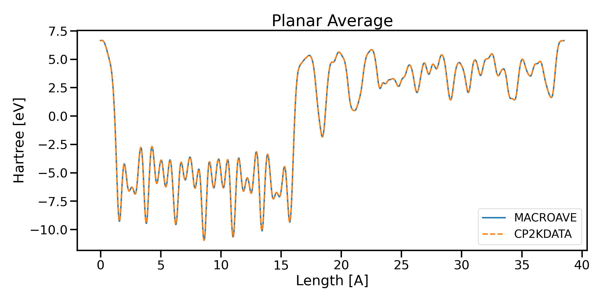

# cp2kdata: Processing CP2K Cube Files

The `cp2kdata` Python package provides tools for working with cube files generated by the CP2K quantum chemistry software. One of the standout features of this package is its ability to handle CP2K cube files and perform various analyses.

## Getting Started
Import the necessary modules and load a cube file:
```python
from cp2kdata import Cp2kCube

cube_file = "xxx.cube"
mycube = Cp2kCube(cube_file)
```
## Retrieving Structural Information
CP2K cube files include structural information, making it easy to work with atomic structures. You can retrieve this information using the `get_stc()` method:

```python
stc = mycube.get_stc()
print(stc)
```

## Planar Averaging
You can calculate planar average data from the cube file, both with and without interpolation:
```python
# Get planar average data without interpolation
pav_x, pav = mycube.get_pav(axis="z", interpolate=False)

# Get planar average data with interpolation (4096 interpolation points)
pav_x, pav = mycube.get_pav(axis="z", interpolate=True)
```

## Macro Averaging
The `get_mav()` method allows you to compute macro average data with or without interpolation. Specify the length of the first and second periodicity (l1 and l2) and the system type (ncov) as parameters:

```python
# Get macro average data without interpolation
mav_x, mav = mycube.get_mav(l1=4.8, l2=4.8, ncov=1, interpolate=False)

# Get macro average data with interpolation
mav_x, mav = mycube.get_mav(l1=4.8, l2=4.8, ncov=2, interpolate=True)

```

## Addition and Subtraction of Cp2kCubes
The Cp2kCubeNew class provides a convenient way to perform addition and subtraction operations on CP2K cube files, allowing you to manipulate the data contained within them.
```python
from cp2kcube.cube.cube import Cp2kCubeNew as Cp2kCube

# Load the first cube file
cube1 = Cp2kCube("path/to/cube1.cube")

# Load the second cube file
cube2 = Cp2kCube("path/to/cube2.cube")
```
```python
# Perform addition of two Cp2kCube objects, the values of two cubes are added
result_cube = cube1 + cube2

# Perform subtraction of two Cp2kCube objects, the values of two cubes are subtract
result_cube = cube1 - cube2

```

## Quick Plotting
Easily create quick plots of your data with the quick_plot() method. You can specify the axis, interpolation, and output directory:

```python
mycube.quick_plot(axis="z", interpolate=False, output_dir="./")
```

## Benchmark Comparison
The Planar Average and Macro Average results from cp2kdata are benchmarked against those from Siesta and Abinit, as shown in the following figures:



Note: The Planar Average and Macro Average results in this package are benchmarked against [Siesta and Abinit](https://docs.siesta-project.org/projects/siesta/reference/macroave.html).