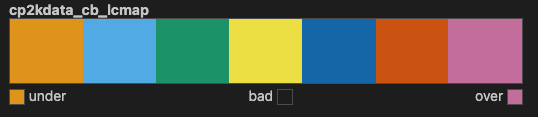
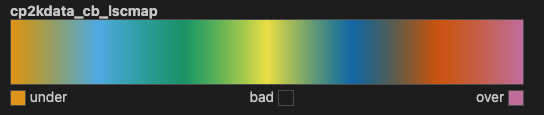
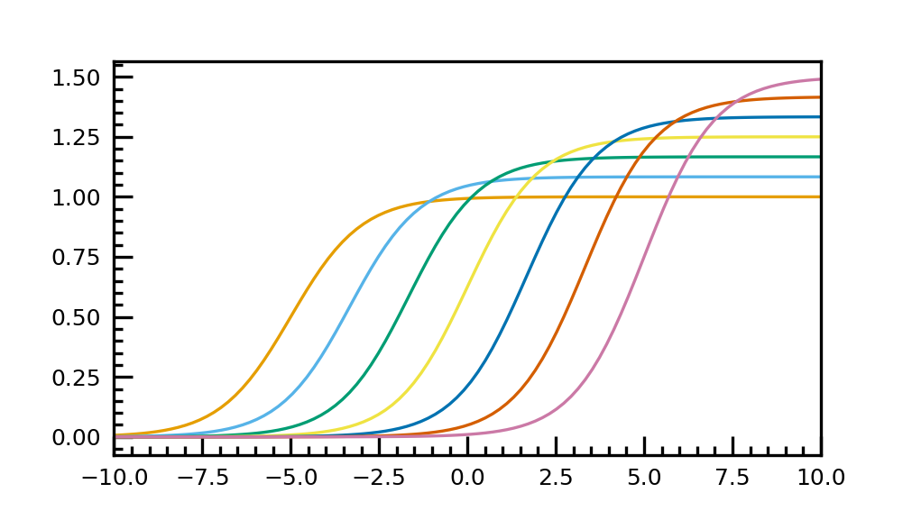
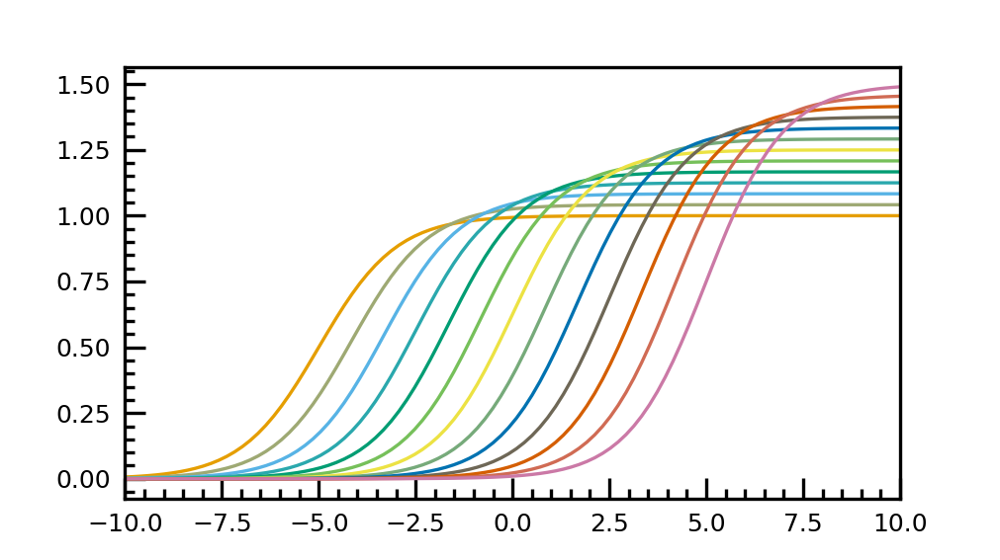

# Plotting in CP2KData

## Color blind friendly colormaps

> If a submitted manuscript happens to go to three male reviewers of Northern European descent, the chance that at least one will be color blind is 22 percent.

by {cite}`wong2010points`

This shows the importance of creating color blind friendly plots.
As suggested by the above reference, I implemented the recommended color blind friendly colormaps in the CP2KData package.
The usage is summarized in the following,

1. Register the colormaps using cp2kdata

    ```python
    import matplotlib as mpl
    import cp2kdata.plots.colormaps
    ```
    ```stdout
    #output
    color blind friendly colormap registered as cp2kdata_cb_lcmap
    color blind friendly colormap registered as cp2kdata_cb_lscmap
    ```

2. Get the colormaps

    There are two colormaps in the package.
    The first one is a listed colormap, which can also be understood as a discrete colormap.
    ```python
    mpl.colormaps['cp2kdata_cb_lcmap']
    ```
    

    The second one is a linear segmented colormap, which can also be understood as a continuous colormap.
    ```python
    mpl.colormaps['cp2kdata_cb_lscmap']
    ```
    

3. Example for using the listed colormap
    ```python
    import matplotlib.pyplot as plt
    import matplotlib as mpl
    import numpy as np
    import cp2kdata.plots.colormaps
    plt.style.use('cp2kdata.matplotlibstyle.jcp')


    cp2kdata_cb_lcmap = mpl.colormaps['cp2kdata_cb_lcmap']
    plt.rcParams["axes.prop_cycle"] = plt.cycler("color", cp2kdata_cb_lcmap.colors)
    row = 1
    col = 1
    fig = plt.figure(figsize=(3.37*col, 1.89*row), dpi=300, facecolor='white')
    gs = fig.add_gridspec(row,col)
    ax  = fig.add_subplot(gs[0])

    t = np.linspace(-10, 10, 100)
    def sigmoid(t, t0):
        return 1 / (1 + np.exp(-(t - t0)))

    nb_colors = len(plt.rcParams['axes.prop_cycle'])

    shifts = np.linspace(-5, 5, nb_colors)
    amplitudes = np.linspace(1, 1.5, nb_colors)
    for t0, a in zip(shifts, amplitudes):
        ax.plot(t, a * sigmoid(t, t0), '-')
    ax.set_xlim(-10, 10)

    fig.savefig("cb_lcmap_plot.png", dpi=100)
    ```
    
4. Example for using the linear segmented colormap
    ```python
    import matplotlib.pyplot as plt
    import matplotlib as mpl
    import numpy as np
    import cp2kdata.plots.colormaps
    plt.style.use('cp2kdata.matplotlibstyle.jcp')


    cp2kdata_cb_lscmap = mpl.colormaps['cp2kdata_cb_lscmap']
    N = 13
    plt.rcParams["axes.prop_cycle"] = plt.cycler("color", cp2kdata_cb_lscmap(np.linspace(0,1,N)))
    row = 1
    col = 1
    fig = plt.figure(figsize=(3.37*col, 1.89*row), dpi=300, facecolor='white')
    gs = fig.add_gridspec(row,col)
    ax  = fig.add_subplot(gs[0])

    t = np.linspace(-10, 10, 100)
    def sigmoid(t, t0):
        return 1 / (1 + np.exp(-(t - t0)))

    nb_colors = len(plt.rcParams['axes.prop_cycle'])

    shifts = np.linspace(-5, 5, nb_colors)
    amplitudes = np.linspace(1, 1.5, nb_colors)
    for t0, a in zip(shifts, amplitudes):
        ax.plot(t, a * sigmoid(t, t0), '-')
    ax.set_xlim(-10, 10)

    fig.savefig("cb_lscmap_plot.png", dpi=100)
    ```
    
